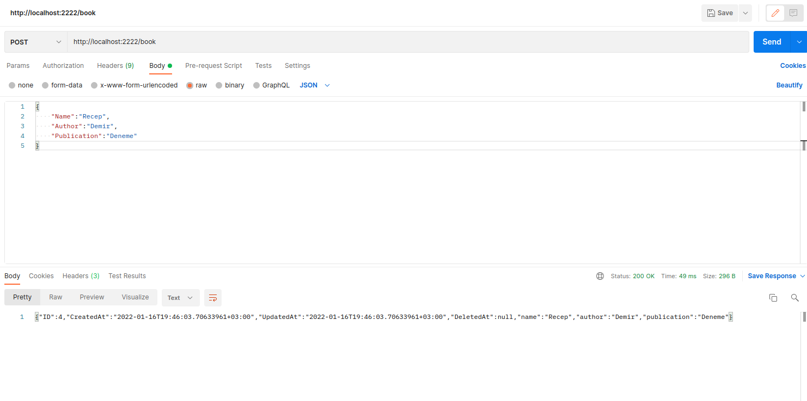
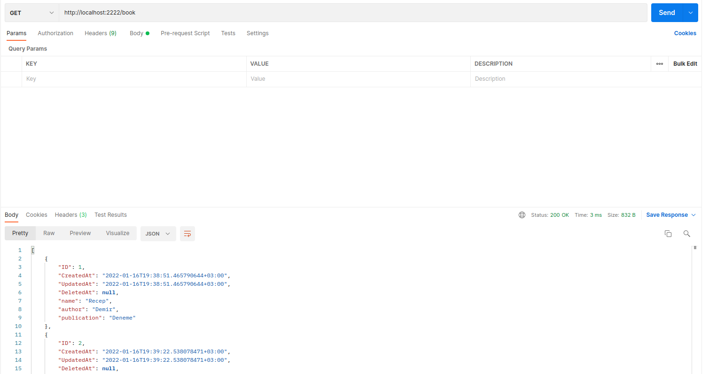

# Book store with Golang

    This project building golang 1.17. I'm used gorilla/mux, gorm, gorm sqlite.

# Run application
    
    go run cmd/main.go

# Check application

    go to http://localhost:2222

# Add new record

# Get all record

